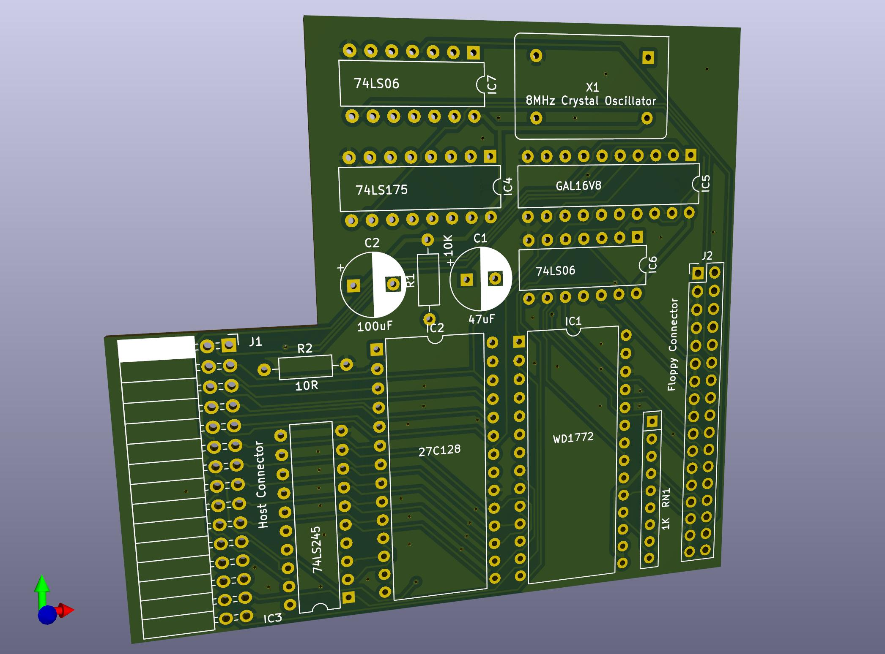

# The recreated Computer One floppy disk interface for the ICL One Per Desk.
## Version 1.0: 14th July, 2024.

This is a reverse engineered version of the Computer One floppy disk interface for the ICL One Per Desk.

The circuitry has been simpified by replacing a great deal of discrete logic with a single GAL to handle the address decoding and the clock circuit has been replaced by a crystal oscillator.

The included ROM image also has beenmodified to add a BIOS Parameter Block to the boot sector on the floppy disk format so that MSDOS PCs and Atari STs can read it. Unfortunately if PCs try to write to the disk it will corrupt the format. In tests Atari STs can correctly write to the disks.

It should be noted that using the OPD Microdrive Utilities copy is hit and miss with Gotek drives for some reason. With real floppy disks it's fine.

If you wish to use EPROMs larger than a 27C128 use bodge wires to connect pins 1 and 27 of the ROM to ground or put multiple copies of the image onto the EPROM.

What you will need:

7 x 10nF 0805 ceramic capacitors (decoupling on rear).

1 x Right-angled 2.54mm pitch 15x2 header socket (female).

1 x 2.54mm pitch through hole 17x2 shrounded header.

2 x 74LS06

1 x 74LS245

1 x 74LS175

1 x 27C128 EPROM (or larger pin compatible EPROM or EEPROM)

1 x WD1772

1 x 8MHz crystal oscillator

1 x 100uF 16V radial electrolytic capacitor

1 x 47uF 16V radial electrolytic capacitor

1 x 9 pin 1K matrix resistor

1 x 10K 2W resistor

1 x 10 ohm 2W resistor

